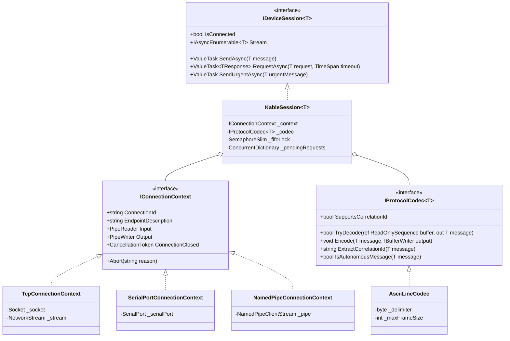

<!-- Kable Architecture Overview Document -->

  <!-- Hero Header Banner -->
  

    

      🏛️ 3-TIER LAYERED TOPOLOGY
    

    <h1 style="margin: 0 0 10px 0; font-size: 28px; font-weight: 800; letter-spacing: -0.5px; color: #ffffff; border-bottom: none; padding-bottom: 0;">
      01. Architecture Overview
    </h1>
    

      Core design philosophy, hybrid transaction routing, and formal class hierarchy combining <strong>Microsoft Bedrock's transport abstraction</strong> with <strong>RSocket reactive interaction patterns</strong>.
    

    

      Bedrock Transport
      RSocket Interaction
      Hybrid Transaction Router
      Fail-Fast Watchdog
    

  

  <!-- 3-Tier Layer Summary Cards -->
  

    

      
1. Upper: RSocket Interaction

      

        Provides <code>RequestAsync</code>, <code>SendAsync</code>, <code>Stream</code>, and <code>SendUrgentAsync</code> (E-STOP) contracts on <code>IDeviceSession&lt;T&gt;</code>.
      

    

    

      
2. Middle: Protocol Codec

      

        Bidirectional zero-allocation framing and slicing (<code>ReadOnlySequence&lt;byte&gt;</code>) via <code>IProtocolCodec&lt;T&gt;</code>.
      

    

    

      
3. Lower: Bedrock Transport

      

        Unifies TCP, RS-232/485 serial, and NamedPipe IPC under a <code>PipeReader Input</code> and <code>PipeWriter Output</code> context.
      

    

  

  <!-- Section 1: Core Architectural Philosophy -->
  

    <h2 style="font-size: 18px; font-weight: 800; color: #0f172a; margin: 0 0 14px 0; display: flex; align-items: center; gap: 8px;">
      
      1. Core Architectural Philosophy
    </h2>

    

      <code>Kable</code> solves the four classic failure modes of industrial hardware software: <strong>thread starvation, heap fragmentation, interleaved response pollution, and UI stuttering</strong>.
    

    <!-- Key Innovation Callout -->
    

      
💡 Hybrid Transaction Router & Fail-Fast Safety

      <ul style="margin: 0; padding-left: 18px; font-size: 12.5px; color: #334155; line-height: 1.6;">
        <li><strong>Preemptive FIFO Lock (SemaphoreSlim)</strong>: For legacy devices without correlation IDs, concurrent requests are serialized safely without frame collisions.</li>
        <li><strong>Lock-Free Interleaving</strong>: For modern protocols with correlation tokens, requests are multiplexed concurrently at microsecond latencies.</li>
        <li><strong>Fail-Fast Disconnection</strong>: Physical cable disconnect immediately fires <code>DeviceDisconnectedException</code>, driving equipment to safe-state without blind retries.</li>
      </ul>
    

  

  <!-- Section 2: Architecture Class Diagram -->
  

    <h2 style="font-size: 18px; font-weight: 800; color: #0f172a; margin: 0 0 14px 0; display: flex; align-items: center; gap: 8px;">
      
      2. Integrated Architecture Class Diagram
    </h2>

  

