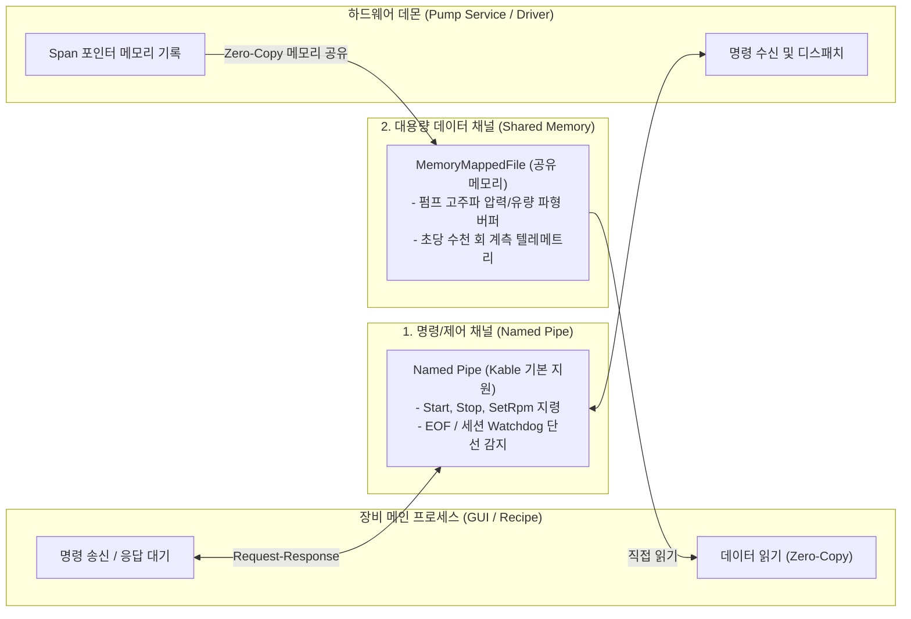
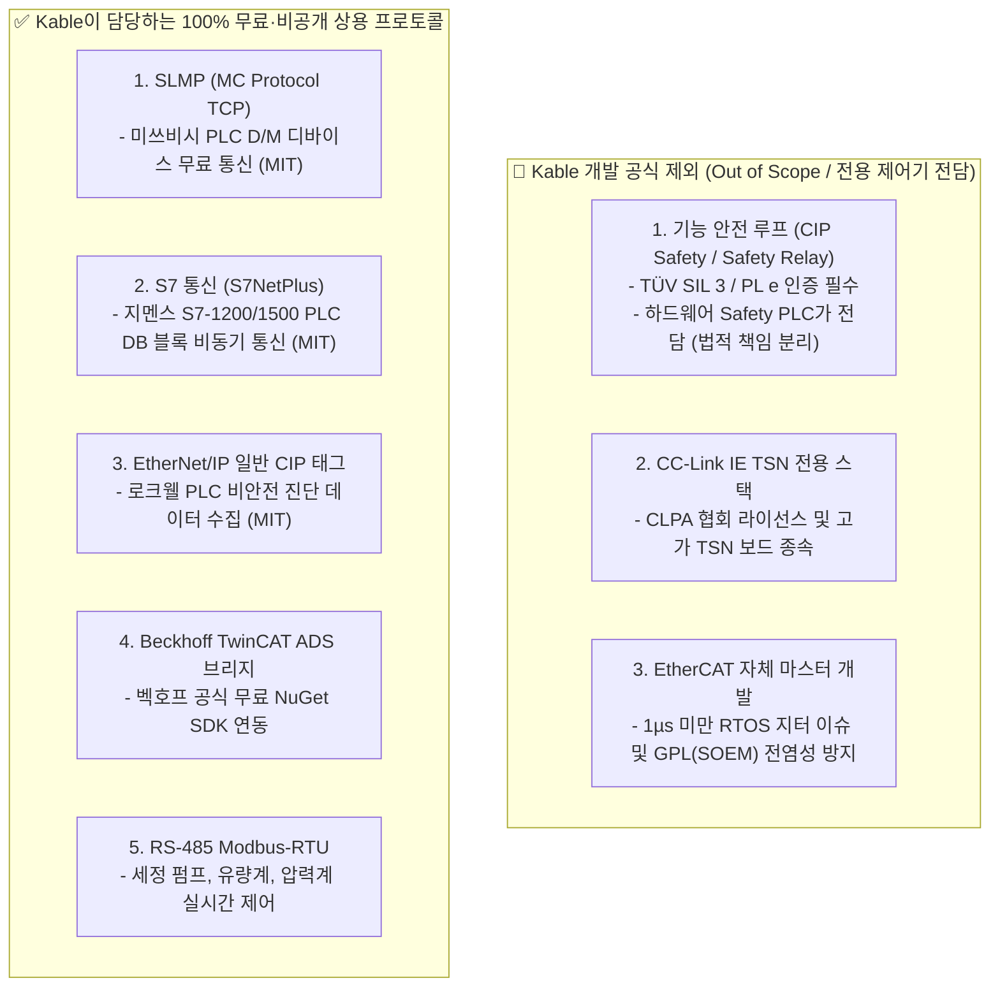
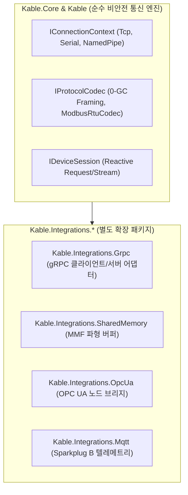

# 06. 산업용 고신뢰성 통신 기술 비교 및 Kable 아키텍처 연동 로드맵

- **문서 번호**: KABLE-SPEC-06
- **문서 버전**: v1.2.0
- **작성일**: 2026-09-16
- **기준 Kable 버전**: v1.2.0
- **모듈 위치**: `02.SoftwareLib/01.Kable/docs/06_INDUSTRIAL_HIGH_RELIABILITY_COMM_ROADMAP.md`

---

## 1. 개요 및 Kable의 시스템 경계 (System Scope)

### 1.1 Kable의 역할 및 책임 한계
> [!IMPORTANT]
> **Kable은 Hard Real-Time 모션 제어기나 Safety Controller(기능 안전 제어기)가 아닙니다.**  
> Kable은 반도체/정밀 제조 장비에서 **비안전(Non-Safety) 영역의 장비 제어 통신, 관측(Observability), 텔레메트리 스트리밍 및 상위 연동**을 고성능·저할당(Zero-Allocation 지향)으로 중계하는 통신 엔진입니다.

1. **하드웨어 제어 경계**:
   - EtherCAT, PROFINET, CIP Safety 등 안전 및 마이크로초 단위의 동기화가 필요한 영역은 Kable이 직접 마스터/스택을 구현하지 않으며, **인증된 하드웨어 컨트롤러, 전용 벤더 SDK, 또는 검증된 오픈소스 스택(SOEM 등)과 연동하는 어댑터(Adapter/Integration)** 계층으로 결합합니다.
2. **Kable v1.2.0 기본 Transport 제공 범위**:
   - `UseTcp()`: 표준 OS 소켓 기반 스트림 통신.
   - `UseSerialPort()`: 표준 직렬 포트(RS-232C 등) 통신 어댑터. (※ RS-485 통신의 경우 반이중 TX/RX 방향 전환이나 멀티드롭 버스 충돌 중재는 외장 컨버터 또는 상위 시퀀스에서 보조해야 함).
   - `UseNamedPipe()`: 단일 OS 내 프로세스 격리 통신.
   - **단선 감지 조건**: 읽기 실패, 소켓 EOF 수신, 또는 세션 레벨의 Heartbeat/Watchdog 타임아웃 만료 시 `DeviceDisconnectedException`을 발행 (즉시 하드웨어 인터럽트 감지가 아님).

---

## 2. 산업용 통신 프로토콜 비교 매트릭스 (결정론 및 범위 경계 명시)

| 계층 | 기술 / 프로토콜 | 주 사용처 | 실시간성 분류 (Determinism Class) | 라이선스 형태 및 비용 | Kable 로드맵 상태 | Kable 연동 권장 방안 |
| :--- | :--- | :--- | :--- | :---: | :---: | :--- |
| **PC 내부 IPC** | **1. Named Pipe IPC** | 프로세스 격리 (Daemon 연동) | **Soft Real-Time** | **OS 표준 (무료)** | **✅ 기본 제공** | `UseNamedPipe()` 기본 탑재 |
| | **2. 프로세스 간 MMF SharedQueue** | 초고속 락프리 IPC | **Soft Real-Time** | **순수 구현 (무료)** | ❌ **프로세스 간 미지원** | **[Phase 2]** 별도 어댑터로 검토 |
| | **3. Shared Memory (MMF Raw Bulk)**| 비전 영상, 파형 데이터 | **Best Effort** (대용량 전송) | **순수 구현 (무료)** | ❌ **미지원** | 초고속 파형 버퍼 어댑터 검토 |
| **PC ↔ PC / 원격** | **4. Raw TCP Socket** | 일반 네트워크 장비 연동 | **Best Effort** | **OS 표준 (무료)** | **✅ 기본 제공** | `UseTcp()` 기본 탑재 |
| | **5. gRPC (HTTP/2 + Protobuf)** | 분산 모듈 RPC / 원격 제어 | **Soft Real-Time** | **Apache-2.0 / BSD (무료)** | 🚀 **[Phase 2 개발 착수]** | `Kable.Integrations.Grpc` |
| | **6. OPC UA (IEC 62541)** | 설비-호스트, 스마트 캐비닛 | **Soft Real-Time** | **OPC Dual / MIT (무료)** | ❌ **미지원** | **[Phase 3]** `Kable.Integrations.OpcUa` |
| | **7. DDS (Data Distribution)** | 분산 실시간 제어 버스 | **Soft Real-Time** | **EDL-1.0 / BSD (무료)** | ❌ **직접 구현 제외** | 필요 시 CycloneDDS C# 바인딩 연동 |
| | **8. MQTT (Sparkplug B)** | 센서/유틸리티 텔레메트리 | **Best Effort** | **MIT (무료)** | ❌ **미지원** | **[Phase 3]** `Kable.Integrations.Mqtt` |
| **필드버스 / PLC** | **9. RS-232C / RS-485** | 시리얼 펌프, 센서, 유량계 | **Soft Real-Time** | **OS 표준 / MIT (무료)** | **✅ 기본 제공** | `UseSerialPort()`, Modbus-RTU |
| | **10. EtherCAT** | 초정밀 서보 모터 다축 제어 | **Hard Real-Time** | **GPL(SOEM) / 상용 라이선스** | 🚫 **[자체 마스터 개발 제외]** | 외부 상용 마스터(Beckhoff ADS 등) SDK 브리지 |
| | **11. PROFINET ➔ S7 통신** | 지멘스 S7 PLC 데이터 연동 | **Soft Real-Time** | **MIT (`S7NetPlus`) (무료)** | 🔄 **[S7 이더넷 통신으로 대체]** | `Kable.Integrations.Siemens` (S7 프로토콜) |
| | **12. EtherNet/IP (비안전 CIP)**| 로크웰 PLC 태그 데이터 연동 | **Soft Real-Time** | **MIT / Apache (무료)** | 🔄 **[비안전 진단 태그로 대체]** *(⚠️ CIP Safety 안전 루프는 영구 제외)* | `Kable.Integrations.EtherNetIP` (일반 CIP 태그) |
| | **13. CC-Link ➔ SLMP (MC)** | 미쓰비시 PLC D/M 디바이스 | **Soft Real-Time** | **미쓰비시 무료 오픈 규격 (무료)** | 🔄 **[SLMP 오픈 규격으로 대체]** *(⚠️ TSN 전용 보드 스택은 영구 제외)* | `Kable.Integrations.Melsec` (SLMP TCP) |

> [!NOTE]
> **실시간성 분류 기준**:
> - **Hard Real-Time**: 데드라인 위반 시 시스템 실패로 간주되는 영역. 일반 윈도우 OS 단독으로는 불가하며, 전용 실시간 확장(RTOS/RT-Extension), CPU 코어 격리, 전용 NIC가 필수 전제됨.
> - **Soft Real-Time**: 통상 수 ms 이내에 처리되나 통계적 편차(지터)가 허용되는 제어 영역 (대부분의 펌프, 밸브, 비전 트리거 등).
> - **Best Effort**: 처리 지연시간에 대한 엄격한 보장 없이 대역폭 기반으로 전송되는 영역 (대용량 로그, 영상 스트림 등).

---

## 3. IPC 통신 아키텍처: 명령(Command)과 대용량 데이터의 분리

단일 PC 내에서 장비 UI/오케스트레이터와 하드웨어 드라이버 데몬 간 통신 시, 부하 특성에 따라 채널을 분리하는 구조가 권장됩니다.

### 3.1 Named Pipe vs SharedQueue 비교 분석
- **Named Pipe**:
  - **장점**: OS 커널 레벨에서 스트림 라이프사이클을 관리하므로 상대 프로세스 크래시 시 예외 감지가 명확하며, 요청-응답 트랜잭션 구현이 단순합니다.
  - **적용**: 펌프 구동/정지, 파라미터 변경, 상태 질의 등 **명령/제어 채널**.
- **프로세스 간 SharedQueue (MMF SPSC RingBuffer)**:
  - **장점**: 시스템 콜(Syscall) 오버헤드가 없어 초고속 메시지 전달에 유리합니다.
  - **주의사항**: 송신 프로세스가 비정상 종료되었을 때 메모리 락 상태 복구, 순환 큐 포인터 재정렬 등 복잡한 안전장치가 요구됩니다.
  - **Kable 코드 현황**: 현재 Kable에는 인메모리 단일 프로세스용 `SpscRingBuffer<T>`([SpscRingBuffer.cs](file:///d:/Johnny/00.New/02.SoftwareLib/01.Kable/src/Kable.Engine.Disruptor/SpscRingBuffer.cs))가 구현되어 있으며, **프로세스 간(Inter-Process) MMF 기반 SharedQueue는 향후 벤치마크 검증 후 도입할 확장 검토 항목**입니다.

### 3.2 IPC 성능 지표 및 벤치마크 계획
IPC 지연 시간은 절대 수치가 아니며, 실행 환경에 따라 크게 좌우됩니다. Kable은 향후 다음과 같은 조건 하에 정량 지표를 측정할 계획입니다:
- **측정 시나리오**: 단일 요청-응답 왕복 지연시간 (Round-Trip Latency)
- **지표 항목**: p50, p99, p99.9 백분위수 지연시간
- **환경 변수**: 메시지 크기 (64B, 1KB, 64KB), CPU Affinity(코어 고정 여부), OS 부하 상태 (유휴 vs 고부하)

---

## 4. 물리 필드버스 / PLC 통신 및 안전·라이선스 경계 가이드

### 4.1 안전 루프 및 고가 하드웨어 스택의 명확한 경계 (Out of Scope 원칙)

Kable은 100% Permissive(Apache-2.0 / MIT) 생태계를 유지하고 장비사의 독점 소스코드를 보호하기 위해 **유료 협회 라이선스, 법적 인증 필수 안전 루프, GPL 전염성 스택을 공식 개발 범위에서 제외**합니다.

### 4.2 프로토콜별 현실적 대체 및 연동 방안

1. **EtherCAT (10번)**:
   - Kable이 C# 레벨에서 마스터를 자체 개발하지 않습니다. (SOEM 라이브러리의 GPL 전염성 및 윈도우 스케줄링 지터로 인한 모터 탈조 위험).
   - 실제 장비에서는 전용 모션 보드 또는 Beckhoff IPC가 하드웨어 루프를 돌리고, Kable은 벡호프의 무료 공식 라이브러리(`Beckhoff.TwinCAT.Ads`) 등을 통해 좌표 및 상태를 조회하는 **브리지 어댑터** 역할만 수행합니다.
2. **PROFINET IRT ➔ S7 통신 대체 (11번)**:
   - 지멘스 전용 통신 ASIC 칩셋(ERTEC)이 필요한 PROFINET IRT 대신, 순수 C# MIT 라이선스 오픈소스인 **`S7NetPlus`** 기반 어댑터를 채택하여 일반 이더넷 케이블로 지멘스 PLC와 통신합니다.
3. **CIP Safety ➔ 일반 EtherNet/IP 태그 통신 대체 (12번)**:
   - 비상정지 E-Stop, 안전 라이트 커튼은 공인 Safety PLC(Rockwell GuardLogix 등)가 전담하며, Kable은 법적 안전 루프에 관여하지 않습니다.
   - 대신 일반 CIP 통신으로 "어떤 안전 도어가 열려 정지했는가?"와 같은 **비안전 진단 텔레메트리**만 수집합니다.
4. **CC-Link IE TSN ➔ SLMP (MC Protocol) 대체 (13번)**:
   - CLPA 협회 라이선스와 전용 PCIe 인터페이스 카드가 필요한 CC-Link IE TSN 대신, 미쓰비시의 공식 무료 오픈 규격인 **SLMP (Seamless Message Protocol, TCP/IP)** 어댑터를 구축하여 일반 랜선으로 미쓰비시 PLC D/M 디바이스를 0-Allocation으로 제어합니다.

---

## 5. Kable의 패키지 분리 및 단계별 로드맵 (Roadmap)

Kable의 코어 계층은 순수 **0-GC 바이트 스트림 파이프라인(`System.IO.Pipelines`)**에만 집중하며, 상위 프로토콜 및 하드웨어 버스는 **독립 확장 패키지(Integrations)**로 분리합니다.

- **v1.2.0 (현재 완료)**:
  - `System.IO.Pipelines` 기반 0-GC 세션 엔진.
  - 기본 Transport 어댑터 (`UseTcp`, `UseSerialPort`, `UseNamedPipe`).
  - 인메모리 `SpscRingBuffer<T>` 및 `ModbusRtuCodec` (CRC-16 자동화).
- **Phase 2 (단기 확장 계획)**:
  - `Kable.Integrations.Grpc`: PC 간 프로세스 격리 및 원격 시뮬레이터를 위한 gRPC 양방향 스트리밍 어댑터.
  - `Kable.Integrations.SharedMemory`: 고주파 아날로그 파형 수집을 위한 프로세스 간 MMF 버퍼 채널.
- **Phase 3 (중장기 확장 계획)**:
  - `Kable.Integrations.OpcUa`: 스마트 팩토리 상위 연동용 OPC UA 클라이언트 어댑터.
  - `Kable.Integrations.Mqtt`: 설비 텔레메트리 수집용 MQTT Sparkplug B 커넥터.

---

## 6. 공식 라이브러리 스택 선정 및 상용 라이선스 거버넌스 (Licensing Governance)

Kable의 확장 어댑터 개발 시 바퀴를 재발명(Zero-base 개발)하지 않고, 마이크로소프트 및 글로벌 오픈소스 재단이 유지보수하는 **공식 표준 라이브러리(Official Standard Stacks)**를 채택합니다.
모든 채택 라이브러리는 상용 반도체/FA 장비에 탑재되어 판매될 때 **소스코드 공개 의무가 없는(Permissive) 상용 친화적 라이선스**를 충족합니다.

### 6.1 기술별 채택 공식 라이브러리 및 라이선스 매트릭스

| 기술 분류 | 채택 대상 공식 패키지 (NuGet) | 개발/관리 주체 | 라이선스 형태 | 소스코드 비공개 유지 가능 여부 | 상용 장비 탑재 적합성 |
| :--- | :--- | :--- | :---: | :---: | :---: |
| **gRPC 클라이언트** | **`Grpc.Net.Client`** | Microsoft / gRPC Authors | **Apache-2.0** | **✅ 100% 가능 (No Copyleft)** | 최상 (Windows/Linux 공식 표준) |
| **gRPC 서버** | **`Grpc.AspNetCore.Server`** | Microsoft / gRPC Authors | **Apache-2.0** | **✅ 100% 가능 (No Copyleft)** | 최상 (Kestrel 초고속 웹서버 기반) |
| **Protobuf 직렬화** | **`Google.Protobuf`** | Google LLC | **BSD-3-Clause** | **✅ 100% 가능 (No Copyleft)** | 최상 (이진 바이너리 0-Allocation) |
| **Protobuf 컴파일러** | **`Grpc.Tools`** | gRPC Authors | **Apache-2.0** | **✅ 100% 가능 (빌드타임 도구)** | 최상 (C# 클래스 소스 생성기) |
| **OPC UA 상위 연동** | **`OPCFoundation.NetStandard.Opc.Ua`** | OPC Foundation 공식 | **OPC Foundation Dual (MIT 호환)** | **✅ 100% 가능** | 글로벌 스마트팩토리 표준 충족 |
| **MQTT 텔레메트리** | **`MQTTnet`** | MQTTnet Community | **MIT** | **✅ 100% 가능** | 경량 IoT/센서 표준 |

### 6.2 상용 장비 제조사 관점의 법적 안전성 (Legal Clearance)

1. **소프트웨어 지적재산권(IP) 보호 (전염성 카피레프트 제로)**:
   - 채택된 `Apache-2.0`, `MIT`, `BSD-3-Clause` 라이선스는 GPL/AGPL과 같은 전염성(Copyleft) 조항이 전무합니다.
   - 장비 제어 시퀀스, 레시피 알고리즘, 독점 비즈니스 로직 소스코드를 외부에 공개할 법적 의무가 일절 발생하지 않으며, **순수 비공개 상용 바이너리(DLL/EXE)로 고객사에 납품 가능**합니다.
2. **특허권 보호 (Patent Grant in Apache 2.0)**:
   - `Apache-2.0` 라이선스는 구글 및 마이크로소프트가 해당 소프트웨어에 기여한 기술 특허를 사용자에게 **영구적·전 세계적·무상의 특허 사용권(Patent License)**으로 부여함을 명시하고 있어, 향후 잠재적 특허 분쟁 위험을 원천 차단합니다.
3. **법적 준수 의무 (Compliance Requirement)**:
   - 장비 납품 매뉴얼 또는 소프트웨어 정보(About 창, License.txt 고지 파일)에 해당 패키지의 **저작권 고지문(Copyright Notice) 및 라이선스 전문 텍스트를 포함**하는 것만으로 모든 법적 의무가 완전히 종결됩니다.

