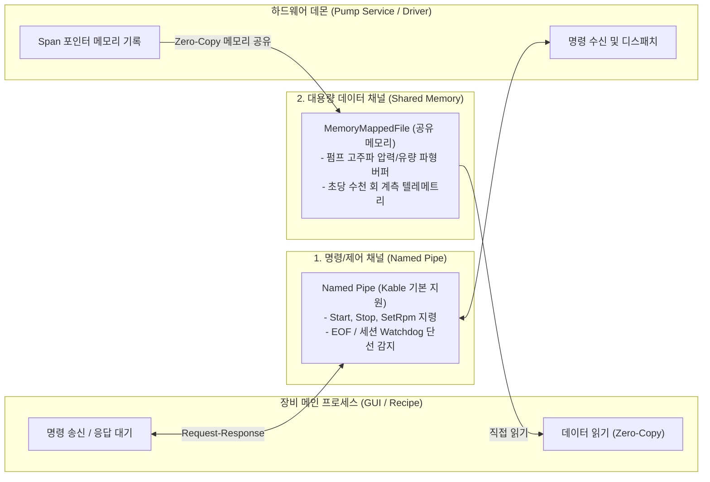
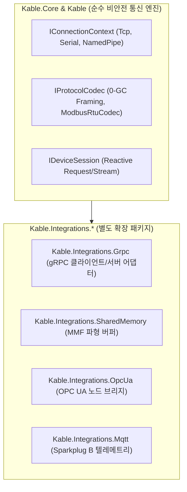

# 06. 산업용 고신뢰성 통신 기술 비교 및 Kable 아키텍처 연동 로드맵

- **문서 번호**: KABLE-SPEC-06
- **문서 버전**: v1.2.0
- **작성일**: 2026-09-16
- **기준 Kable 버전**: v1.2.0
- **모듈 위치**: `02.SoftwareLib/01.Kable/docs/06_INDUSTRIAL_HIGH_RELIABILITY_COMM_ROADMAP.md`

---

## 1. 개요 및 Kable의 시스템 경계 (System Scope)

### 1.1 Kable의 역할 및 책임 한계
> [!IMPORTANT]
> **Kable은 Hard Real-Time 모션 제어기나 Safety Controller(기능 안전 제어기)가 아닙니다.**  
> Kable은 반도체/정밀 제조 장비에서 **비안전(Non-Safety) 영역의 장비 제어 통신, 관측(Observability), 텔레메트리 스트리밍 및 상위 연동**을 고성능·저할당(Zero-Allocation 지향)으로 중계하는 통신 엔진입니다.

1. **하드웨어 제어 경계**:
   - EtherCAT, PROFINET, CIP Safety 등 안전 및 마이크로초 단위의 동기화가 필요한 영역은 Kable이 직접 마스터/스택을 구현하지 않으며, **인증된 하드웨어 컨트롤러, 전용 벤더 SDK, 또는 검증된 오픈소스 스택(SOEM 등)과 연동하는 어댑터(Adapter/Integration)** 계층으로 결합합니다.
2. **Kable v1.2.0 기본 Transport 제공 범위**:
   - `UseTcp()`: 표준 OS 소켓 기반 스트림 통신.
   - `UseSerialPort()`: 표준 직렬 포트(RS-232C 등) 통신 어댑터. (※ RS-485 통신의 경우 반이중 TX/RX 방향 전환이나 멀티드롭 버스 충돌 중재는 외장 컨버터 또는 상위 시퀀스에서 보조해야 함).
   - `UseNamedPipe()`: 단일 OS 내 프로세스 격리 통신.
   - **단선 감지 조건**: 읽기 실패, 소켓 EOF 수신, 또는 세션 레벨의 Heartbeat/Watchdog 타임아웃 만료 시 `DeviceDisconnectedException`을 발행 (즉시 하드웨어 인터럽트 감지가 아님).

---

## 2. 산업용 통신 프로토콜 비교 매트릭스 (결정론 및 환경 조건 명시)

| 계층 | 기술 / 프로토콜 | 주 사용처 | 실시간성 분류 (Determinism Class) | 달성 전제 조건 (OS / HW / 튜닝) | Kable 현재 지원 상태 | Kable 연동 권장 방안 |
| :--- | :--- | :--- | :--- | :--- | :---: | :--- |
| **PC 내부 IPC** | **1. Named Pipe IPC** | 프로세스 격리 (Daemon 연동) | **Soft Real-Time** | 일반 OS 커널, 블로킹 I/O | **✅ 기본 제공** | `UseNamedPipe()` 기본 탑재 |
| | **2. 프로세스 간 MMF SharedQueue** | 초고속 락프리 IPC | **Soft Real-Time** | MMF 링버퍼, CPU 코어 격리 | ❌ **프로세스 간 미지원** *(단, In-Process SPSC 큐는 보유)* | **[Phase 2]** 별도 어댑터로 검토 |
| | **3. Shared Memory (MMF Raw Bulk)**| 비전 영상, 파형 데이터 | **Best Effort** (대용량 전송) | 가상 메모리 매핑, 페이징 고려 | ❌ **미지원** | 초고속 파형 버퍼 어댑터 검토 |
| **PC ↔ PC / 원격** | **4. Raw TCP Socket** | 일반 네트워크 장비 연동 | **Best Effort** | 일반 네트워크 스위치, Nagle Off | **✅ 기본 제공** | `UseTcp()` 기본 탑재 |
| | **5. gRPC (HTTP/2 + Protobuf)** | 모듈 간 RPC 및 원격 제어 | **Soft Real-Time** | LAN 환경, HTTP/2 멀티플렉싱 | ❌ **미지원** | **[Phase 2]** `Kable.Integrations.Grpc` |
| | **6. OPC UA (IEC 62541)** | 설비-호스트, 스마트 캐비닛 | **Soft Real-Time** | OPC UA .NET Standard 스택 | ❌ **미지원** | **[Phase 3]** `Kable.Integrations.OpcUa` |
| | **7. DDS (Data Distribution)** | 분산 실시간 제어 버스 | **Hard / Soft Real-Time** | 실시간 OS 또는 QoS 튜닝 전제 | ❌ **미지원** | 필요 시 외부 바인딩 연동 |
| | **8. MQTT (Sparkplug B)** | 센서/유틸리티 텔레메트리 | **Best Effort** | 경량 브로커(Broker) 인프라 | ❌ **미지원** | **[Phase 3]** `Kable.Integrations.Mqtt` |
| **필드버스 / 구동계** | **9. RS-232C / RS-485** | 시리얼 펌프, 센서, 유량계 | **Soft Real-Time** | 점대점/반이중 타이밍 제어 필요 | **✅ 직렬 포트 제공** | `UseSerialPort()` 기본 탑재 |
| | **10. EtherCAT** | 초정밀 서보 모터, 실시간 IO | **Hard Real-Time** *(마스터 조건부)* | **전용 실시간 OS/코어, Intel NIC, DC** | ❌ **직접 구현 비대상** | 외부 마스터(SOEM 등) 연동 |
| | **11. PROFINET (IRT)** | 지멘스 PLC 기반 산업 라인 | **Hard Real-Time** *(IRT 조건부)* | 지멘스 통신 ASIC/인터페이스 보드 | ❌ **직접 구현 비대상** | PLC 게이트웨이 연동 |
| | **12. EtherNet/IP (CIP Safety)**| 로크웰 PLC 기반 안전 공정 | **기능 안전 연동** *(SIL 3 적용 지원)* | **인증된 안전 하드웨어 및 안전 루프 입증** | ❌ **직접 구현 비대상** | 공인 안전 컨트롤러 연동 |
| | **13. CC-Link IE TSN** | 일본/국내 반도체 라인 | **Hard Real-Time** *(TSN 조건부)* | TSN 전용 스위치 및 인터페이스 보드 | ❌ **직접 구현 비대상** | 전용 보드 드라이버 연동 |

> [!NOTE]
> **실시간성 분류 기준**:
> - **Hard Real-Time**: 데드라인 위반 시 시스템 실패로 간주되는 영역. 일반 윈도우 OS 단독으로는 불가하며, 전용 실시간 확장(RTOS/RT-Extension), CPU 코어 격리, 전용 NIC가 필수 전제됨.
> - **Soft Real-Time**: 통상 수 ms 이내에 처리되나 통계적 편차(지터)가 허용되는 제어 영역 (대부분의 펌프, 밸브, 비전 트리거 등).
> - **Best Effort**: 처리 지연시간에 대한 엄격한 보장 없이 대역폭 기반으로 전송되는 영역 (대용량 로그, 영상 스트림 등).

---

## 3. IPC 통신 아키텍처: 명령(Command)과 대용량 데이터의 분리

단일 PC 내에서 장비 UI/오케스트레이터와 하드웨어 드라이버 데몬 간 통신 시, 부하 특성에 따라 채널을 분리하는 구조가 권장됩니다.

### 3.1 Named Pipe vs SharedQueue 비교 분석
- **Named Pipe**:
  - **장점**: OS 커널 레벨에서 스트림 라이프사이클을 관리하므로 상대 프로세스 크래시 시 예외 감지가 명확하며, 요청-응답 트랜잭션 구현이 단순합니다.
  - **적용**: 펌프 구동/정지, 파라미터 변경, 상태 질의 등 **명령/제어 채널**.
- **프로세스 간 SharedQueue (MMF SPSC RingBuffer)**:
  - **장점**: 시스템 콜(Syscall) 오버헤드가 없어 초고속 메시지 전달에 유리합니다.
  - **주의사항**: 송신 프로세스가 비정상 종료되었을 때 메모리 락 상태 복구, 순환 큐 포인터 재정렬 등 복잡한 안전장치가 요구됩니다.
  - **Kable 코드 현황**: 현재 Kable에는 인메모리 단일 프로세스용 `SpscRingBuffer<T>`([SpscRingBuffer.cs](file:///d:/Johnny/00.New/02.SoftwareLib/01.Kable/src/Kable.Engine.Disruptor/SpscRingBuffer.cs))가 구현되어 있으며, **프로세스 간(Inter-Process) MMF 기반 SharedQueue는 향후 벤치마크 검증 후 도입할 확장 검토 항목**입니다.

### 3.2 IPC 성능 지표 및 벤치마크 계획
IPC 지연 시간은 절대 수치가 아니며, 실행 환경에 따라 크게 좌우됩니다. Kable은 향후 다음과 같은 조건 하에 정량 지표를 측정할 계획입니다:
- **측정 시나리오**: 단일 요청-응답 왕복 지연시간 (Round-Trip Latency)
- **지표 항목**: p50, p99, p99.9 백분위수 지연시간
- **환경 변수**: 메시지 크기 (64B, 1KB, 64KB), CPU Affinity(코어 고정 여부), OS 부하 상태 (유휴 vs 고부하)

---

## 4. 물리 필드버스 및 구동계 통신 가이드

### 4.1 모션 제어 vs 유체/센서 통신의 현실적 분리
1. **초정밀 다축 모션 제어 (로봇 암, 웨이퍼 얼라이너, 서보 드라이브)**:
   - **산업 표준 기술**: **EtherCAT**
   - **현실적 제약**: EtherCAT은 표준 이더넷 하드웨어를 활용할 수 있으나, **1µs 미만의 지터와 동기화를 달성하려면 Real-Time OS(또는 Windows RT 확장의 코어 격리), 전용 NIC 드라이버, Distributed Clocks(DC) 설정 및 실제 계측 검증**이 반드시 전제되어야 합니다.
   - **Kable의 연동 방식**: Kable이 소프트웨어 레벨에서 직접 EtherCAT 마스터를 구현하기보다는, 상용/오픈소스 EtherCAT 마스터 소프트웨어(SOEM 등)가 제어하는 상태를 읽고 쓰는 **브리지 어댑터** 형태로 연동하는 것이 안전합니다.
2. **유체 / 화학 / 환경 센서 제어 (세정 펌프, 유량계, 압력계, 밸브)**:
   - **산업 표준 기술**: **Modbus-RTU / RS-485**
   - **특징**: 펌프 RPM 지령, 압력 조회 등은 50~100ms 주기의 소프트 실시간으로 충분하며, 화학/반도체 유체 장비의 절대 다수가 RS-485 Modbus를 지원하므로 비용과 안정성 면에서 가장 실용적입니다.
3. **기능 안전(Safety) 통신 주의사항 (CIP Safety / PROFINET IRT)**:
   - CIP Safety는 네트워크 프로토콜 차원에서 안전 통신(SIL 3 수준)을 정의하지만, **시스템 전체의 안전성은 인증된 안전 PLC, 안전 I/O 모듈, 비상정지 회로 및 국제 인증(IEC 61508) 검증을 거쳐 별도로 입증**되어야 합니다.
   - Kable은 비안전 통신 계층이므로, 하드웨어 E-Stop 라인과 공인 안전 컨트롤러를 대체할 수 없습니다.

---

## 5. Kable의 패키지 분리 및 단계별 로드맵 (Roadmap)

Kable의 코어 계층은 순수 **0-GC 바이트 스트림 파이프라인(`System.IO.Pipelines`)**에만 집중하며, 상위 프로토콜 및 하드웨어 버스는 **독립 확장 패키지(Integrations)**로 분리합니다.

- **v1.2.0 (현재 완료)**:
  - `System.IO.Pipelines` 기반 0-GC 세션 엔진.
  - 기본 Transport 어댑터 (`UseTcp`, `UseSerialPort`, `UseNamedPipe`).
  - 인메모리 `SpscRingBuffer<T>` 및 `ModbusRtuCodec` (CRC-16 자동화).
- **Phase 2 (단기 확장 계획)**:
  - `Kable.Integrations.Grpc`: PC 간 프로세스 격리 및 원격 시뮬레이터를 위한 gRPC 양방향 스트리밍 어댑터.
  - `Kable.Integrations.SharedMemory`: 고주파 아날로그 파형 수집을 위한 프로세스 간 MMF 버퍼 채널.
- **Phase 3 (중장기 확장 계획)**:
  - `Kable.Integrations.OpcUa`: 스마트 팩토리 상위 연동용 OPC UA 클라이언트 어댑터.
  - `Kable.Integrations.Mqtt`: 설비 텔레메트리 수집용 MQTT Sparkplug B 커넥터.
