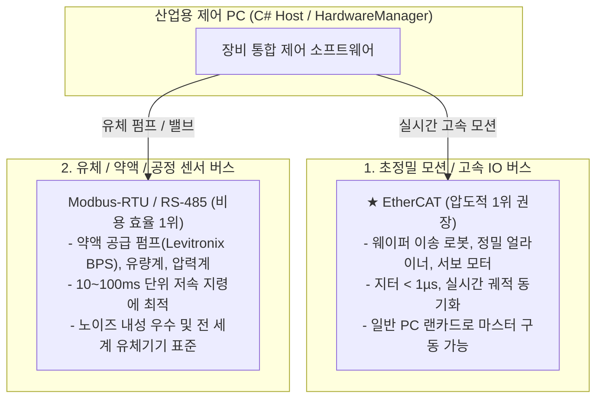
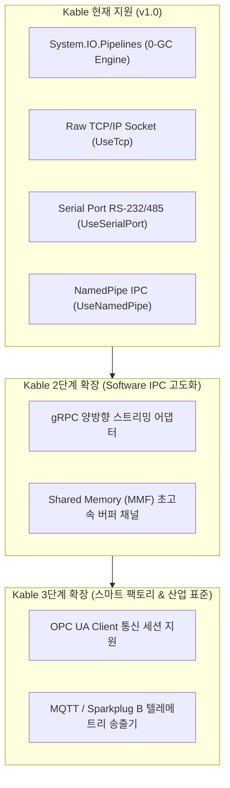

# 06. 산업용 차세대 고신뢰성 통신 기술 스펙트럼 및 Kable 로드맵

- **문서 번호**: KABLE-SPEC-06
- **버전**: v1.0.0
- **작성일**: 2026-09-16
- **모듈 위치**: `02.SoftwareLib/01.Kable/docs/06_INDUSTRIAL_HIGH_RELIABILITY_COMM_ROADMAP.md`

---

## 1. 개요 및 배경

전통적인 장비 통신은 주로 **Raw TCP/IP Socket**이나 **RS-232C/485 직렬 통신**에 의존해 왔습니다.
그러나 반도체 클린룸, 초정밀 화학 제어, 배터리 공정 등 현대 첨단 장비에서는 다음과 같은 한계로 인해 **결정론적(Deterministic) 고신뢰성 통신 기술**이 도입되고 있습니다:

1. **Raw TCP/IP의 한계**:
   - 혼잡 제어 및 Nagle 알고리즘 등으로 인한 불시의 수십~수백 ms 지터(Jitter).
   - 비정상 단선(Unplug) 발생 시 TCP Keep-Alive 감지에 수 초~수십 초 소요.
   - 바이트 스트림 파편화(Fragmentation)로 인한 패킷 파싱 오류 위험.
2. **Kable의 포지셔닝**:
   - `01.Kable`은 현재 `System.IO.Pipelines` 기반의 **0-GC 버퍼 파이프라인, Fail-Fast 즉시 단선 감지, RS-485/TCP/NamedPipe 지원**을 완료한 상태입니다.
   - 본 문서는 현재 Kable 지원 범위와 미지원 고신뢰성 프로토콜 전체 스펙트럼을 투명하게 비교하고 확장 로드맵을 정의합니다.

---

## 2. 전체 산업용 통신 프로토콜 지원 현황 비교 매트릭스

| 계층 | 기술 / 프로토콜 | 주 사용처 | 신뢰도 / 결정론 (Determinism) | Kable 현재 지원 여부 | 향후 대응 방안 |
| :--- | :--- | :--- | :--- | :---: | :--- |
| **PC 내부 IPC** | **1. Named Pipe IPC** | 동일 PC 내 프로세스 격리 (Daemon) | ★★★★★ (OS 커널 직결) | **✅ 지원 완료** | `UseNamedPipe()` 탑재 |
| | **2. Shared Memory RingBuffer (SharedQueue)** | 락프리 초고속 IPC (마이크로초 이하 지연) | ★★★★★ (Zero-Copy / Zero-Syscall) | ❌ 미지원 (검토 대상) | **[Phase 2]** MMF 기반 Lock-free SPSC 큐 탑재 |
| | **3. Shared Memory (MMF Raw Bulk)** | 초고속 비전 영상, 파형 대용량 버퍼 | ★★★★★ (RAM 포인터 직결) | ❌ 미지원 | 초고주파 계측용 MMF Transport 검토 |
| **PC ↔ PC / 원격** | **4. Raw TCP Socket** | 일반 네트워크 장비 연동 | ★★★☆☆ (지터 발생 가능) | **✅ 지원 완료** | `UseTcp()` 탑재 |
| | **4. gRPC (Protobuf)** | PC 간 / 모듈 간 고속 제어 표준 | ★★★★☆ (스키마 타입 보장) | ❌ 미지원 | Kable 상위 gRPC Gateway 어댑터 구축 |
| | **5. OPC UA (IEC 62541)** | 반도체 설비 상위 표준 (TSN 결합) | ★★★★★ (표준 보안/모델링) | ❌ 미지원 | OPC UA .NET Standard 스택 바인딩 |
| | **6. DDS (Data Distribution)** | 분산 실시간 제어, 로봇 연계 | ★★★★★ (P2P Zero-Broker) | ❌ 미지원 | CycloneDDS / OpenDDS C# 바인딩 |
| | **7. MQTT (Sparkplug B)** | 센서/유틸리티 텔레메트리 수집 | ★★★☆☆ (QoS 1, 2) | ❌ 미지원 | 경량 브로커 수집 클라이언트 모듈화 |
| **필드버스 / 구동계** | **8. RS-232C / RS-485** | 시리얼 펌프, 센서, 유량계 | ★★★★☆ (FIFO 엄격 보장) | **✅ 지원 완료** | `UseSerialPort()` 탑재 |
| | **9. EtherCAT** | 초정밀 서보 모터, 실시간 IO | ★★★★★ (**지터 < 1µs 확정성**) | ❌ 미지원 (하드웨어 버스) | SOEM 마스터 또는 전용 NIC 드라이버 연동 |
| | **10. PROFINET (IRT)** | 지멘스 PLC 기반 산업 라인 | ★★★★★ (지터 < 1µs) | ❌ 미지원 | 지멘스 산업용 통신 보드 연동 |
| | **11. EtherNet/IP (CIP Safety)**| 로크웰 PLC 기반 안전 제어 | ★★★★★ (SIL 3 안전 보장) | ❌ 미지원 | CIP 스택 라이브러리 연동 |
| | **12. CC-Link IE TSN** | 일본/국내 반도체 라인 | ★★★★★ (TSN 패킷 우선순위) | ❌ 미지원 | 전용 통신 보드 드라이버 연동 |
| | **13. CANopen / DeviceNet** | 노이즈 극심한 모터/밸브 버스 | ★★★★☆ (차동 신호 내노이즈) | ❌ 미지원 | Kvaser / PEAK CAN SDK 어댑터 |

---

## 3. 계층별 통신 기술 세부 해설

### 3.1 PC 내부 초고속 IPC (In-PC Communication)
1. **Named Pipe (현재 지원)**:
   - Windows/Linux 커널의 파이프 버퍼를 활용하여 네트워크 스택(TCP/IP)을 타지 않음.
   - 단일 PC에서 장비 GUI 프로세스와 하드웨어 백그라운드 서비스(Pump Daemon 등)를 격리할 때 최적의 성능 제공.
2. **Shared Memory RingBuffer / SharedQueue (검토 대상 - 초고속 락프리 IPC)**:
   - **동작 원리**: OS의 `MemoryMappedFile(MMF)` 기반 가상 메모리를 공유하고, 그 위에 **Lock-free SPSC(Single Producer Single Consumer) 원형 큐(RingBuffer)**를 배치.
   - **동기화 기법**: 프로세스 간 시그널은 Windows `EventWaitHandle` 또는 CAS(Interlocked SpinLock) 연산 사용.
   - **핵심 장점**:
     - **OS System Call(Syscall) 제거**: Named Pipe는 OS 커널 모드 전환(Context Switch)이 발생하지만, SharedQueue는 유저 레벨 메모리 주소 직결(Direct RAM)로 **나노초~마이크로초(µs) 미만 지연** 달성.
     - **Zero-Copy & Zero-GC**: `Span<byte>`를 공유 큐 슬롯에 직접 기록하므로 가비지 컬렉션(GC) 및 메모리 복사가 전무함.
   - **적용처**: 초당 수만 회의 모션 제어 좌표 갱신, 고속 I/O 스캔, 펌프 텔레메트리 링버퍼.
3. **MemoryMappedFile (대용량 Raw 벌크 버퍼)**:
   - 초당 수 기가바이트의 비전 카메라 검사 영상이나 초음파 고속 아날로그 파형 데이터를 복사 없이 포인터로 직결.

### 3.2 분산 PC 및 상위 시스템 연동 (High-Level Network)
1. **gRPC (HTTP/2 + Protocol Buffers)**:
   - 현대 소프트웨어 장비 제어의 사실상 표준.
   - 강타입(Strongly-Typed) 계약으로 클라이언트-서버 간 데이터 규격 불일치를 컴파일 타임에 원천 차단.
2. **OPC UA over TSN**:
   - 반도체/스마트팩토리 표준(IEC 62541). 장비 내부 변수와 객체를 표준 트리 구조로 탐색 및 보안 암호화 통신.
3. **DDS (Data Distribution Service)**:
   - 중앙 서버/브로커 없이 장비 내 모든 노드가 P2P로 데이터를 주고받으며, 22가지의 세부 QoS(신뢰도, 지연시간, 수명)를 설정 가능.

### 3.3 물리 구동계 필드버스 (Hard Real-Time Fieldbus)
1. **EtherCAT (최고 권장 / 글로벌 표준)**:
   - 일반 이더넷 프레임이 슬레이브 노드를 통과하는 동안 데이터를 실시간으로 읽고 쓰는 'Processing-on-the-fly' 구조.
   - 100마이크로초 이내에 수십 축 모터의 위치를 완전 동기화 (지터 < 1µs).
   - 마스터 구축 시 고가의 전용 하드웨어 보드 없이 일반 PC 랜카드(NIC)로 구동 가능하여 비용과 성능 모두 최상.
2. **CIP Safety (EtherNet/IP) / PROFINET IRT**:
   - 지멘스(PROFINET) 또는 로크웰(EtherNet/IP) PLC 기반 공정에서 널리 사용.
   - 별도 하드웨어 배선 없이 소프트웨어 통신 패킷만으로 SIL 3 / PLe 기능 안전(EMO 비상정지) 인증 충족.
3. **Modbus-RTU / RS-485**:
   - 초고속 모션 제어에는 부적합하나, 펌프, 유량계, 압력 센서 등 주기적 상태 모니터링 및 설정 변경에 가장 저렴하고 안정적인 전통 필드버스.

---

### 3.4 IPC 통신 설계 심층 비교: Named Pipe vs SharedQueue (명령 vs 데이터 분리)

장비 제어 아키텍처에서 IPC를 설계할 때 **명령(Command)**과 **데이터(Telemetry/Bulk Data)**의 특성을 분리하여 접근해야 합니다:

| 비교 항목 | **명령/제어 채널 (Command)** | **대용량 데이터 채널 (Bulk Data)** |
| :--- | :--- | :--- |
| **최적 추천 기술** | **`Named Pipe IPC` (강력 권장)** | **`Shared Memory (MMF Raw Bulk)`** |
| **핵심 요구사항** | • 요청-응답(ACK/NACK) 트랜잭션 보장 • 프로세스 크래시 시 0ms 즉각 단선 감지(Fail-Fast) • 완벽한 순서 보장(FIFO) 및 OS 수준 안정성 | • 마이크로초(µs) 미만 제로카피 접근 • 대용량 고속 파형(Waveform)/영상 버퍼 • GC 힙 할당 0% (`Span<byte>` 포인터) |
| **SharedQueue를 쓰지 않는 이유** | • `SharedQueue`는 락프리 링버퍼로 속도는 빠르나(1µs 미만), 프로세스 비정상 종료 시 좀비 락/메모리 오염 위험 존재. • 명령/제어는 10~30µs 수준의 Named Pipe로도 기계 응답 대비 완벽한 실시간이며, 안전성이 훨씬 중요함. | • 고정 크기 슬롯(Fixed-size Slot) 링버퍼가 아니면 가변 길이 데이터 처리가 복잡함. 대용량 버퍼는 Raw MMF 포인터가 직관적. |
| **최종 하이브리드 결론** | **[명령] Named Pipe** + **[데이터] Shared Memory (MMF)** 하이브리드 조합이 산업용 표준 정답 |

---

### 3.5 물리 필드버스 / 구동계 선정 가이드: "어떤 것이 가장 좋은가?"

현대 반도체/정밀 제조 장비에서 구동계 필드버스는 **목적에 따라 명확히 2가지로 양분**됩니다:

1. **초정밀 모션 제어 (로봇, 서보 모터, 얼라이너)**: 👉 **`EtherCAT`이 압도적으로 가장 좋습니다.**
   - **이유 1**: 독점 하드웨어 전용 칩셋이 필요한 다른 필드버스와 달리, **일반 PC 메인보드의 인텔 이더넷 랜카드(NIC)를 소프트웨어 마스터(SOEM 등)로 바로 사용**할 수 있어 비용과 확장성이 뛰어납니다.
   - **이유 2**: 지터가 1µs 미만으로 여러 축 모터 간의 완벽한 물리적 위치 동기화가 가능합니다.
2. **유체/화학/센서 제어 (펌프, 유량계, 압력 센서, 히터)**: 👉 **`Modbus-RTU / RS-485`가 가장 실용적이고 좋습니다.**
   - 화학 약액 펌프(Levitronix BPS, 시린지 펌프)나 유량 센서는 모터처럼 1ms 동기화가 필요 없으며(응답 주기 50~100ms), 전 세계 화학/유체 장비의 95%가 RS-485 Modbus를 표준 인터페이스로 채택하고 있습니다.
3. **공장 라인 전체가 지멘스/로크웰 PLC 중심일 때**:
   - 지멘스 중심 라인: **`PROFINET (IRT)`**
   - 로크웰(AB) 중심 라인: **`EtherNet/IP (CIP Safety)`** (소프트웨어 비상정지 SIL 3 공인)

## 4. Kable의 단계별 진화 로드맵 (Expansion Roadmap)

- **Phase 1 (완료)**: `Serial`, `TCP`, `NamedPipe`를 아우르는 0-GC 리액티브 파이프라인.
- **Phase 2 (단기 계획)**: 장비 프로세스 격리 및 원격 시뮬레이터를 위한 **`gRPC Transport 어댑터`** 개발.
- **Phase 3 (중장기 계획)**: 스마트 캐비닛 및 공장 상위 연동을 위한 **`OPC UA` / `MQTT Sparkplug B` 커넥터** 모듈화.
