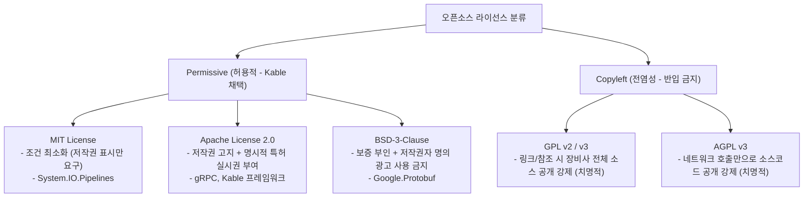

# Kable 오픈소스 라이선스 및 거버넌스 규정 (Open-Source Licensing & Compliance Guide)

> **문서 상태**: 공식 승인 (Approved)  
> **적용 대상**: `Kable.Core`, `Kable`, `Kable.Integrations.*`, `Kable.ConfigStudio`  
> **표준 문서 번호**: `KBL-LIC-2026-V1`

---

## 1. 라이선스 정책 개요 (Overview)

반도체, 디스플레이, 첨단 2차전지 공정 장비의 소프트웨어는 **핵심 제어 시퀀스, 독점 레시피 알고리즘, 공정 노하우**를 완벽하게 보호해야 합니다.
`Kable` 프레임워크 및 향후 확장 생태계(`Kable.Integrations.*`)는 다음과 같은 **엄격한 라이선스 거버넌스 원칙**을 따릅니다:

1. **전염성(Copyleft) 완전 배제 (Zero-Copyleft Guarantee)**:
   - GPL, LGPL, AGPL, SSPL 등 장비 제조사의 독점 소스코드 공개를 강제하는 라이선스를 가진 외부 라이브러리의 참조 및 번들링을 **원천 금지**합니다.
2. **허용적(Permissive) 오픈소스 라이선스만 채택**:
   - `Apache-2.0`, `MIT`, `BSD-3-Clause`, `MS-PL` 등 상용 소프트웨어 개발 및 독점 바이너리 납품에 제약이 없는 라이선스만 사용합니다.
3. **특허 분쟁 리스크 차단 (Patent Retaliation & Express Grant)**:
   - Microsoft 및 Google 등이 주도하는 `Apache-2.0` 라이브러리를 채택하여 명시적인 글로벌 영구 특허 실시권을 확보합니다.

---

## 2. 모듈 및 의존성 라이선스 매트릭스 (License Matrix)

### 2.1 Kable 자체 프로젝트 라이선스
- **Kable 프레임워크 자체**: **Apache License 2.0**
  - 고객사/장비사에 라이브러리(DLL) 형태로 번들링되어 납품되더라도, 장비사의 애플리케이션 코드를 공개할 필요가 없습니다.

### 2.2 핵심 엔진 및 공식 확장 패키지 의존성 분석

| 패키지 이름 | 사용 영역 | 원저작자 / 관리 주체 | 라이선스 | 소스코드 공개 의무 | 상용 장비 탑재 안전성 |
| :--- | :--- | :--- | :---: | :---: | :---: |
| **`System.IO.Pipelines`** | 0-GC 세션 파이프라인 (핵심) | Microsoft (.NET Foundation) | **MIT** | **❌ 없음** | 최상 (마이크로소프트 공식 런타임) |
| **`System.IO.Ports`** | RS-232 / RS-422 / RS-485 통신 | Microsoft (.NET Foundation) | **MIT** | **❌ 없음** | 최상 (.NET 공식 하드웨어 드라이버) |
| **`Grpc.Net.Client`** | PC 간 통신 / 원격 시뮬레이터 연동 | Microsoft / gRPC Authors | **Apache-2.0** | **❌ 없음** | 최상 (HTTP/2 멀티플렉싱, 특허 보증) |
| **`Grpc.AspNetCore.Server`**| 초고속 IPC / 장비 gRPC 호스트 | Microsoft / gRPC Authors | **Apache-2.0** | **❌ 없음** | 최상 (Kestrel 웹서버 엔진 기반) |
| **`Google.Protobuf`** | Protobuf 이진 직렬화/역직렬화 | Google LLC | **BSD-3-Clause** | **❌ 없음** | 최상 (바이너리 0-Allocation) |
| **`Grpc.Tools`** | 빌드 타임 C# 스텁/클라이언트 생성 | gRPC Authors | **Apache-2.0** | **❌ 없음** | 최상 (컴파일 단계 코드 생성기) |
| **`OPCFoundation.NetStandard.Opc.Ua`** | Phase 3 스마트팩토리 연동 | OPC Foundation 공식 | **OPC Dual (MIT 호환)** | **❌ 없음** | 최상 (글로벌 표준 인증 라이브러리) |
| **`MQTTnet`** | Phase 3 설비 텔레메트리/브로커 | MQTTnet Community | **MIT** | **❌ 없음** | 최상 (경량 IoT 메시징 표준) |

---

## 3. 라이선스 유형별 상세 비교 및 법적 효력



### 3.1 Apache License 2.0 (Kable, Grpc.Net.Client)
- **상용 활용**: 자유로운 수정, 복제, 서브라이선스 발급 및 독점(Proprietary) 바이너리 판매 가능.
- **특허 보증 조항 (Section 3 - Grant of Patent License)**:
  - 기여자가 소프트웨어에 포함된 특허에 대해 사용자에게 영구적, 전 세계적, 비독점적, 무상의 특허 라이선스를 명시적으로 부여합니다.
  - 장비 제조사가 타사의 부당한 특허 침해 소송에 휘말리는 것을 법적으로 방어해 줍니다.
- **의무 사항**:
  1. 원본 저작권 고지문(Copyright Notice) 유지.
  2. Apache 2.0 라이선스 사본 첨부.
  3. 코드를 수정한 경우 수정 사실 명시.

### 3.2 BSD 3-Clause (Google.Protobuf)
- **상용 활용**: 소스코드 및 바이너리 형태로 자유롭게 재배포 가능.
- **3대 조건**:
  1. 소스 재배포 시 저작권 고지 및 면책 조항 유지.
  2. 바이너리 재배포 시 문서 또는 부속 자료에 저작권 고지 포함.
  3. 사전 서면 승인 없이 저작자(Google)의 이름을 홍보/광고 목적으로 사용 불가.

### 3.3 MIT License (System.IO.Pipelines, MQTTnet)
- 가장 간결하고 규제가 없는 라이선스.
- 상용 판매, 수정, 배포 제한 없음.
- 유일한 의무: 저작권 고지문 및 면책 조항 문구를 소프트웨어의 모든 복제본 또는 상당 부분에 포함.

---

## 4. 장비 출하 및 납품 시 컴플라이언스 준수 가이드라인 (Shipping Checklist)

장비 제어 PC에 소프트웨어를 탑재하여 고객사에 납품할 때, 개발팀은 다음 3가지 중 하나의 방법으로 오픈소스 고지 의무를 완료합니다.

### 4.1 배포 디렉터리에 `THIRD_PARTY_LICENSES.txt` 포함
장비 실행 파일(`.exe`)이 위치하는 디렉터리 또는 `docs/` 폴더에 제3자 오픈소스 고지 파일을 생성하여 동봉합니다:

```text
================================================================================
THIRD PARTY SOFTWARE NOTICES AND INFORMATION
================================================================================

This software incorporates components from the projects listed below:

1. Kable Communication Framework
   License: Apache License, Version 2.0
   Copyright (c) 2026 Johnny / Equipment Control Systems

2. gRPC C# (Grpc.Net.Client, Grpc.AspNetCore.Server)
   License: Apache License, Version 2.0
   Copyright 2019 The gRPC Authors

3. Google Protocol Buffers (Google.Protobuf)
   License: BSD 3-Clause License
   Copyright 2008 Google Inc. All rights reserved.

4. System.IO.Pipelines / System.IO.Ports
   License: MIT License
   Copyright (c) .NET Foundation and Contributors

--------------------------------------------------------------------------------
[Full License Texts Attached Below: Apache-2.0, BSD-3-Clause, MIT]
--------------------------------------------------------------------------------
```

### 4.2 GUI 프로그램 'About (소프트웨어 정보)' 창 표기
`Kable.ConfigStudio` 또는 장비 HMI GUI의 [Help] -> [About] 메뉴에 오픈소스 라이선스 고지 탭을 추가하여 스크롤 텍스트 형태로 라이선스를 열람할 수 있도록 지원합니다.

---

## 5. 금지 라이브러리 가이드라인 (Blacklist)

다음 라이선스가 적용된 NuGet 패키지 및 라이브러리는 Kable 및 장비 제어 프로젝트 내 **반입이 엄격히 금지**됩니다:

| 라이선스 | 위험도 | 금지 사유 |
| :--- | :---: | :--- |
| **GPL (v2 / v3)** | 🚨 위험도 극상 | Kable 또는 제어 프로그램이 동적/정적 링크될 경우, **장비사의 전체 제어 시퀀스 소스코드를 고객사 또는 대중에 의무 공개**해야 함. |
| **AGPL (v3)** | 🚨 위험도 극상 | 네트워크/IPC 호출만으로도 서버 및 클라이언트 전체 소스코드 공개 의무가 촉발됨. |
| **SSPL (Server Side Public License)** | 🚨 위험도 상 | 상용 클라우드/서비스 형태 제공 시 전체 관리 인프라 소스코드 공개 요구. |
| **LGPL (v2.1 / v3)** | ⚠️ 조건부 주의 | DLL 동적 링크 시 자체 소스 공개는 피할 수 있으나, 고객사가 해당 DLL을 교체하여 리링크(Re-link)할 수 있는 기술적 수단을 제공해야 하므로 상용 일체형 펌웨어/장비 패키징에 부적합. |

---

## 6. 결론 및 보증

`Kable`과 공식 확장 패키지(`gRPC`, `Protobuf`, `Pipelines` 등)는 **100% Permissive 라이선스(Apache-2.0, MIT, BSD-3)**로 구성되어 있습니다.  
따라서 당사의 독점 기술, 공정 레시피, 장비 시퀀스 로직을 온전히 비공개 상태로 유지하면서, 글로벌 반도체 팹 및 상용 고객사에 법적 리스크 없이 안전하게 영구 배포할 수 있습니다.
