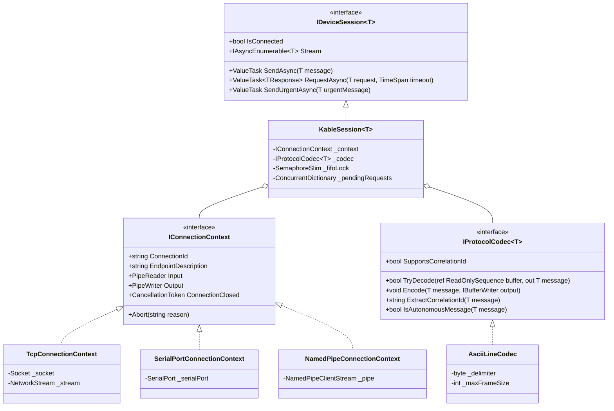

<!-- Kable Architecture Overview Document (Korean) -->

<!-- Hero Header Banner -->

🏛️ 3계층 계층화 토폴로지 (3-TIER LAYERED TOPOLOGY)

<h1 style="margin: 0 0 10px 0; font-size: 28px; font-weight: 800; letter-spacing: -0.5px; color: #ffffff; border-bottom: none; padding-bottom: 0;">
      01. 아키텍처 개요 (Architecture Overview)
</h1>

      <strong>마이크로소프트 Bedrock 전송 추상화</strong>와 <strong>RSocket 반응형 인터랙션 패턴</strong>을 융합한 핵심 설계 철학, 하이브리드 트랜잭션 라우팅 및 정형 클래스 계층 구조입니다.

Bedrock Transport
RSocket Interaction
하이브리드 트랜잭션 라우터
Fail-Fast 워치독

<!-- 3-Tier Layer Summary Cards -->

1. 상위 계층: RSocket 반응형 인터랙션

        <code>IDeviceSession&lt;T&gt;</code>를 통해 <code>RequestAsync</code>, <code>SendAsync</code>, <code>Stream</code>, 그리고 긴급 정지용 <code>SendUrgentAsync</code>(E-STOP) 규약을 제공합니다.

2. 중간 계층: 프로토콜 코덱 (Protocol Codec)

        <code>IProtocolCodec&lt;T&gt;</code>를 통해 양방향 Zero-Allocation 프레이밍 및 메모리 복사 없는 슬라이싱(<code>ReadOnlySequence&lt;byte&gt;</code>)을 수행합니다.

3. 하위 계층: Bedrock 전송 추상화 (Transport)

        TCP, RS-232/485 시리얼, NamedPipe IPC를 단일 <code>PipeReader Input</code> 및 <code>PipeWriter Output</code> 컨텍스트로 일원화합니다.

<!-- Section 1: Core Architectural Philosophy -->

<h2 style="font-size: 18px; font-weight: 800; color: #0f172a; margin: 0 0 14px 0; display: flex; align-items: center; gap: 8px;">

      1. 핵심 아키텍처 설계 철학
</h2>

<code>Kable</code>은 산업용 하드웨어 소프트웨어에서 발생하는 4대 고질적 결함인 <strong>스레드 고갈(Thread Starvation), 힙 메모리 파편화(Heap Fragmentation), 응답 데이터 혼선 및 교차 오염(Interleaved Response Pollution), UI 멈춤/스터터링(UI Stuttering)</strong>을 원천 해결합니다.

<!-- Key Innovation Callout -->

💡 하이브리드 트랜잭션 라우터 & Fail-Fast 안전성

<ul style="margin: 0; padding-left: 18px; font-size: 12.5px; color: #334155; line-height: 1.6;">
<li><strong>선점형 FIFO 락 (SemaphoreSlim)</strong>: Correlation ID(연관 식별자)를 지원하지 않는 레거시 장비 통신 시, 동시 호출 요청을 안전하게 직렬화하여 프레임 충돌을 원천 차단합니다.</li>
<li><strong>Lock-Free 인터리빙 멀티플렉싱</strong>: Correlation 토큰이 포함된 최신 프로토콜 통신 시, 마이크로초(µs) 단위 지연 시간으로 여러 요청을 동시 다중화 처리합니다.</li>
<li><strong>Fail-Fast 연결 단절 전파</strong>: 물리 케이블 단절 즉시 <code>DeviceDisconnectedException</code>을 모든 대기자에게 예외 전파하여, 맹목적인 재시도 없이 설비를 즉각 안전 상태(Safe-State)로 전이합니다.</li>
</ul>

<!-- Section 2: Architecture Class Diagram -->

<h2 style="font-size: 18px; font-weight: 800; color: #0f172a; margin: 0 0 14px 0; display: flex; align-items: center; gap: 8px;">

      2. 통합 아키텍처 클래스 다이어그램
</h2>

