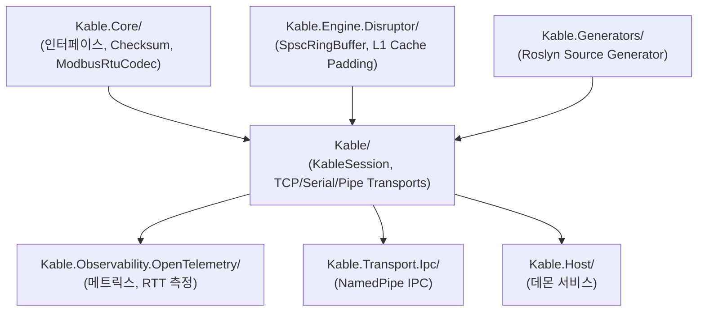

# 01.Kable Source Modules (`src/`)

`02.SoftwareLib/01.Kable/src`는 Microsoft의 `System.IO.Pipelines` 전송 계층과 RSocket 반응형 패턴을 결합하여 Zero-Allocation, 초저지연 하드웨어 I/O 통신을 제공하는 .NET 라이브러리 제품군입니다.

---

## 🏛️ 하위 서브 프로젝트 구성

---

## 📑 주요 서브 프로젝트별 역할

| 서브 프로젝트 | 설명 및 핵심 컴포넌트 |
| :--- | :--- |
| **`Kable.Core/`** | • `IDeviceSession`, `IProtocolCodec`, `ICommObserver` • `IndustrialChecksums`: CRC-16 Modbus / CCITT 초고속 테이블 계산 • `ModbusRtuCodec`: `ReadOnlySequence<byte>` 기반 제로 카피 프레이밍 코덱 |
| **`Kable/`** | • `KableSession`: 하이브리드 트랜잭션 라우터 (비-Correlation FIFO 락 & 고속 파이프라이닝) • `Transports/`: `TcpConnection`, `SerialPortConnection`, `NamedPipeConnection` • `CommObserver`: 텔레메트리, 콘솔, 알람 분리 3채널 링버퍼 |
| **`Kable.Engine.Disruptor/`** | • `SpscRingBuffer<T>`: 단일 생산자-단일 소비자(SPSC) 락프리 링버퍼 • `PaddedSequence`: False Sharing(캐시 바운스)을 방지하기 위한 64바이트 L1 캐시라인 패딩 시퀀스 |
| **`Kable.Generators/`** | • Roslyn C# 소스 생성기: `[DeviceCommand]` 특성을 분석하여 컴파일 타임에 패킷 인코딩/디코딩 보일러플레이트 코드 자동 생성 |
| **`Kable.Observability.OpenTelemetry/`** | • `KableMetricsCollector`: I/O 대역폭, 패킷 처리 지연(Latency RTT), 패킷 에러율 메트릭 수집기 |
| **`Kable.Transport.Ipc/`** | • `IpcNamedPipe`: 프로세스 간 초고속 IPC 통신 어댑터 |
| **`Kable.Host/`** | • `DaemonService`: 윈도우 서비스 또는 백그라운드 데몬으로 Kable 통신 호스팅 |
